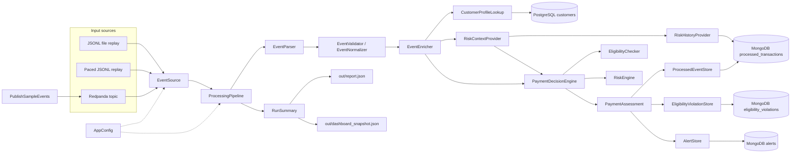

# Payment Event Processing Pipeline

[](https://github.com/IgorKolodziej/payment-event-pipeline/actions/workflows/ci.yml)
[](https://codecov.io/github/IgorKolodziej/payment-event-pipeline)

A Scala 3 payment-event processing pipeline for deterministic local replay and broker-backed stream processing.

The application reads payment events from JSONL files or Redpanda, validates and normalizes them, enriches them with PostgreSQL customer data, evaluates eligibility and risk rules, and persists processed transactions, alerts, and eligibility violations to MongoDB.

The project is backend-focused and intentionally close to professional event-processing workflows: small ports, replaceable adapters, explicit domain contracts, idempotent persistence, and reproducible local infrastructure.

## Highlights

- Multiple input modes behind one `EventSource` port: fast file replay, paced file replay, and Redpanda.
- Functional streaming with FS2 and Cats Effect.
- JSON parsing with Circe and explicit domain error mapping.
- Customer enrichment through Doobie/PostgreSQL.
- MongoDB-backed processing history used for risk context.
- Separate eligibility checks and risk scoring, so business declines are not mixed with fraud/anomaly alerts.
- Idempotent MongoDB writes for processed events, alerts, and eligibility violations.
- Explicit money/currency contract: account currency mismatches are eligibility declines, without synthetic FX conversion.
- Opaque `EventId` and `CustomerId` domain types, stable enum persistence codes, and validated startup configuration.
- Hikari-backed PostgreSQL access and automatic MongoDB index initialization during startup.
- Redpanda sample publisher with optional event pacing for live-style demos.
- Scala.js/Laminar dashboard module and shared dashboard dataset contract.
- MUnit test suite, Scalafmt, GitHub Actions CI, and coverage reporting.

## What This Demonstrates

- Hexagonal architecture with narrow ports and replaceable adapters.
- Functional core and effectful shell: pure parsing, validation, enrichment, eligibility, risk, and reporting logic wrapped by Cats Effect at the boundaries.
- Deterministic replay semantics: file input is processed in order, and risk context is built from previously persisted events.
- Explainable payment decisions: deterministic eligibility violations are separated from scored fraud/anomaly alerts.
- Operational discipline: typed config validation, bounded PostgreSQL pooling, idempotent Mongo persistence, automatic indexes, CI, and local Docker verification.

## Architecture



The core pipeline depends on small ports, not concrete infrastructure. File replay, paced replay, Redpanda, PostgreSQL, and MongoDB live behind adapters in `infrastructure`.

Risk context is computed in `application.risk` from historical processed events loaded through a Mongo-backed `RiskHistoryProvider`.

The same high-level flow lives in `diagrams/system.mmd`; a more detailed component view lives in `diagrams/architecture.mmd`.

## Technology

- JDK `25`
- Scala `3.3.7`
- sbt `1.12.5`
- Cats Effect
- FS2
- Circe
- Doobie
- PostgreSQL
- MongoDB
- Redpanda
- Scala.js + Laminar
- MUnit

## Current Status

The repository has a working end-to-end local pipeline. Docker Compose starts PostgreSQL, MongoDB, and Redpanda; seed/sample data are included; CI runs formatting checks, tests, and coverage generation.

A normal run persists processed transactions, eligibility violations, and risk alerts to MongoDB, prints a run summary, and writes:

- `out/report.json`
- `out/dashboard_snapshot.json`

MongoDB is the primary persisted read/write model for processed transactions, alerts, violations, and risk history. The `dashboard/` module is a static Scala.js/Laminar dashboard that reads the shared dashboard dataset shape when that dataset is exported.

## Local Setup

Requirements:

- JDK `25`
- sbt `1.12.5`
- Docker
- Docker Compose

First-time setup:

```bash
cp .env.example .env
docker compose up -d
set -a && source .env && set +a && sbt run
```

Expected default run shape:

```text
Payment Event Processing Pipeline started. input=sample-data/small_events.jsonl, output=out
Payment Event Processing Pipeline finished. read=200, processed=183, rejected=17, alerts=101
```

Useful commands:

```bash
sbt scalafmtCheckAll scalafmtSbtCheck test
sbt test
sbt clean coverage test coverageReport
sbt scalafmt
sbt Test/scalafmt
docker compose ps -a
docker compose logs postgres
docker compose logs mongo
docker compose logs redpanda
docker compose down
docker compose down -v
```

Open PostgreSQL:

```bash
docker exec -it pep-postgres psql -U pipeline_user -d payment_pipeline
```

Open MongoDB:

```bash
docker compose exec mongo mongosh payment_pipeline
```

## CI

GitHub Actions runs formatting checks and the unit test suite on pull requests and pushes to `main`.
The coverage job generates an scoverage XML report and uploads it to Codecov when available.
Docker-based integration checks for PostgreSQL, MongoDB, and Redpanda remain manual local verification steps.

The local CI-equivalent command is:

```bash
sbt scalafmtCheckAll scalafmtSbtCheck test
```

## Input Modes

The app reads events through an `EventSource` abstraction. Current sources:

- `file`: fast JSONL replay, used by default.
- `paced-file`: JSONL replay with a fixed delay between records, useful for demoing incrementally arriving events.
- `redpanda`: Kafka-compatible broker input using local Redpanda.

Defaults live in `src/main/resources/application.conf`:

```hocon
app {
  inputFile = "sample-data/small_events.jsonl"
  outputDir = "out"
  inputMode = "file"
  streamDelayMillis = 0
}
```

For paced replay:

```bash
set -a && source .env && export APP_INPUT_MODE=paced-file APP_STREAM_DELAY_MILLIS=250 && set +a && sbt run
```

The pacing is implemented at the source boundary with FS2. The processing pipeline itself does not know whether records came from fast file replay, paced replay, or Redpanda.

Replay input should be ordered by event timestamp ascending. Risk context is based on already processed events, so event-time ordering matters for deterministic replay.

### Redpanda Run Path

Redpanda mode models a long-running event consumer. Unlike file replay, it does not naturally finish after the current topic backlog is consumed, so local demo commands usually run it with `timeout` or stop it manually after publishing.

Clean local stack:

```bash
docker compose down -v
docker compose up -d
docker compose ps -a
```

Create the demo topic:

```bash
docker exec pep-redpanda rpk topic create payment-events --brokers localhost:9092
```

Run the app from Redpanda:

```bash
set -a && source .env && export APP_INPUT_MODE=redpanda && set +a && sbt run
```

Publish sample events:

```bash
set -a && source .env && set +a && sbt "runMain com.team.pipeline.tools.PublishSampleEvents"
```

For a live-style demo, publish with a delay between records:

```bash
set -a && source .env && export PUBLISH_DELAY_MILLIS=1000 && set +a && sbt "runMain com.team.pipeline.tools.PublishSampleEvents"
```

Expected publisher output with a one-second delay:

```text
Published 200 events from sample-data/small_events.jsonl to payment-events at localhost:19092 (delay=1000 ms)
```

Watch MongoDB update while the Redpanda consumer is running:

```bash
watch -n 1 'docker compose exec -T mongo mongosh payment_pipeline --quiet --eval '"'"'
printjson({
  processed: db.processed_transactions.countDocuments(),
  alerts: db.alerts.countDocuments(),
  violations: db.eligibility_violations.countDocuments(),
  accepted: db.processed_transactions.countDocuments({ finalDecision: "Accepted" }),
  review: db.processed_transactions.countDocuments({ finalDecision: "Review" }),
  declined: db.processed_transactions.countDocuments({ finalDecision: "Declined" })
})
'"'"'"
```

Verify persisted output after a clean run:

```bash
docker compose exec mongo mongosh payment_pipeline --quiet --eval 'printjson({
  processed: db.processed_transactions.countDocuments(),
  alerts: db.alerts.countDocuments(),
  violations: db.eligibility_violations.countDocuments(),
  duplicateProcessedEventIds: db.processed_transactions.aggregate([
    { $group: { _id: "$eventId", c: { $sum: 1 } } },
    { $match: { c: { $gt: 1 } } }
  ]).toArray().length
})'
```

Expected result on a clean database with the current sample data:

```javascript
{
  processed: 183,
  alerts: 101,
  violations: 163,
  duplicateProcessedEventIds: 0
}
```

Current Redpanda mode is replay-safe for this project because Mongo writes are idempotent. It does not commit Kafka offsets, so repeated local runs can replay broker data by design.

## Dashboard Module

The repository includes a static dashboard module under `dashboard/`, built with Scala.js and Laminar. It shares DTOs and Circe codecs with the backend through the cross-compiled `contract/` project, so the frontend/backend dashboard JSON shape is defined once.

Build the dashboard JavaScript:

```bash
sbt dashboard/fastLinkJS
```

Serve the repository root:

```bash
python3 -m http.server 5173
```

Open:

```text
http://localhost:5173/dashboard/
```

The dashboard page reads `out/dashboard_dataset.json`. The backend currently writes the compact run-level `out/dashboard_snapshot.json` by default; richer dashboard dataset export is represented by the shared contract and dashboard module.

## Mongo Storage

This project uses MongoDB as a replayable read/write model for processed transactions, risk history, alerts, and eligibility violations.

Default collections:

- `processed_transactions` (idempotent upsert by `eventId`)
- `eligibility_violations` (idempotent upsert by `(eventId, violationType)`)
- `alerts` (idempotent upsert by `(eventId, alertType)`)

The app creates required indexes on startup. The definitions are idempotent and use stable names, so a clean local database and repeated app runs need no manual Mongo setup.

Indexes created by the app:

```javascript
use payment_pipeline

db.processed_transactions.createIndex({ eventId: 1 }, { unique: true })
db.processed_transactions.createIndex({ customerId: 1, timestamp: 1 })
db.processed_transactions.createIndex({ customerId: 1, deviceId: 1 })

db.eligibility_violations.createIndex({ eventId: 1, violationType: 1 }, { unique: true })
db.eligibility_violations.createIndex({ customerId: 1 })

db.alerts.createIndex({ eventId: 1, alertType: 1 }, { unique: true })
db.alerts.createIndex({ customerId: 1 })
```

Optional inspection/debug commands:

```javascript
db.processed_transactions.getIndexes()
db.eligibility_violations.getIndexes()
db.alerts.getIndexes()

db.processed_transactions.aggregate([
  { $group: { _id: "$eventId", c: { $sum: 1 } } },
  { $match: { c: { $gt: 1 } } }
])

db.processed_transactions.find({ customerId: 10 }).sort({ timestamp: 1 })
```

## Project Boundaries

This repository mirrors professional payment-event processing architecture in a reproducible local environment. It deliberately keeps the scope focused:

- Redpanda mode is replay-safe for this project but does not commit Kafka offsets.
- MongoDB stores an idempotent current projection, not an append-only audit ledger.
- Currency mismatches are declined through eligibility rules; no FX conversion is modeled.
- Docker-backed integration checks are manual rather than part of CI.
- The risk engine is deterministic and explainable, not a machine-learning model or a generic rule DSL.

## Repository Layout

```text
payment-event-pipeline/
├── .github/workflows/       # CI
├── contract/                # Shared JVM/Scala.js dashboard dataset contract
├── dashboard/               # Static Scala.js + Laminar dashboard
├── diagrams/                # Mermaid architecture diagrams
├── docs/                    # Project notes and issue writeups
├── project/                 # sbt metadata and plugins
├── scripts/                 # PostgreSQL seed data
├── sample-data/             # JSONL payment-event samples
├── src/main/                # Application, domain, ports, and adapters
├── src/test/                # MUnit test suite
├── out/                     # Generated local run artifacts
├── build.sbt
├── docker-compose.yml
└── .env.example
```

## Development

- Work on short-lived feature branches.
- Keep commits focused and readable.
- Format before committing.
- Run `sbt scalafmtCheckAll scalafmtSbtCheck test` before opening a PR.
- Do not commit secrets or generated output files.
- Keep code changes small, tested, and aligned with the agreed project scope.

## Team

- Igor Kołodziej
- Hubert Kowalski
- Kacper Wadas
- Oliwia Strzechowska
- Roksana Rogalska

## License

Apache License 2.0.
